# SettleUp - Bill Splitting App
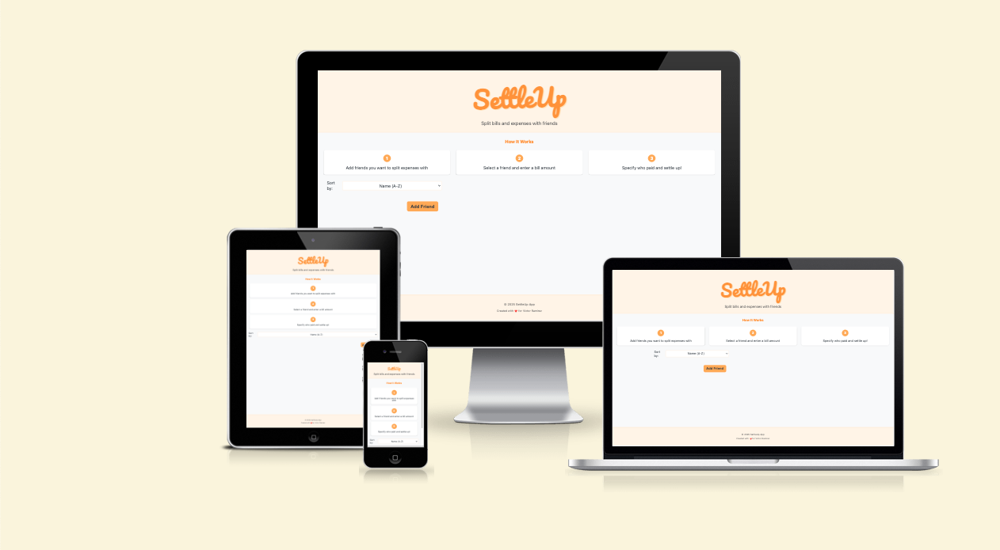
## 💻  Deployment (Run Locally)

```bash
# Clone repository
git clone https://github.com/yourusername/settleup.git

# Install dependencies
npm install

# Start development server
npm start
```


## 🛠 Tech Stack

| Technology | Purpose           | Version |
| ---------- | ----------------- | ------- |
| React      | UI Framework      | 18.2+   |
| Dexie.js   | IndexedDB Wrapper | 3.2+    |
| CSS        | Component Styling | 3       |
| HTML       | Structure, Meta   | 5       |


## 👥 User Stories

### 👋 First-Time User
**As a new user, I want to:**
- Immediately understand how to add friends and split bills
- See example balances to grasp the app's functionality
- Easily navigate between different sections

**Acceptance Criteria:**
- Clear call-to-action buttons visible on first load
- Demo data available via friends.js file
- Intuitive menu structure with <= 3 main sections

### 🔄 Returning User
**As a regular user, I need to:**
- Quickly add new expenses after group activities
- Modify existing entries without data loss
- Filter friends by balance status (owes/owed)


## ✨ Features

### Core Features
| Feature            | Description                 | Implementation      |
| ------------------ | --------------------------- | ------------------- |
| Friend Management  | CRUD operations for friends | React State + Dexie |
| Balance Calculator | Real-time debt tracking     | useEffect hooks     |
| Bill Splitting     | Flexible cost division      | Algorithm Module    |
| Data Persistence   | Offline-first storage       | DB Dexie            |


## 🧩 Component Structure

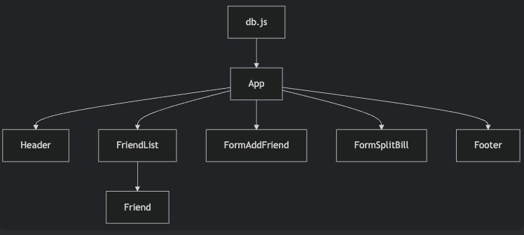


- **App**: Root component managing state
- **Header**: Contains logo and main navigation
- **FriendList**: Renders scrollable list of friends
- **Friend**: Individual friend card component
- **Forms**: Handle user input (AddFriend/SplitBill)
- **Footer**:Date and creator name

## 🔄 Data Flow

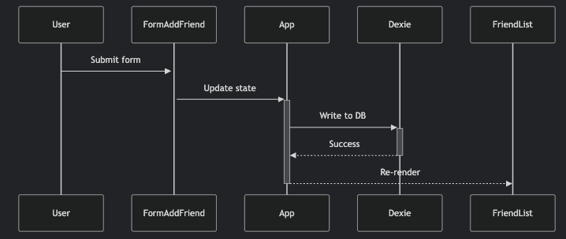

1. User interacts with UI component
2. Event handler updates React state
3. State change triggers Dexie DB update
4. IndexedDB persists data between sessions
5. Components re-render with fresh data

## 🎨 Design System

### Color Palette

| Role      | Hex       | Visual                                                                                       | Usage Examples                                   |
| --------- | --------- | -------------------------------------------------------------------------------------------- | ------------------------------------------------ |
| Primary   | `#ff922b` | <div style="width:20px; height:20px; background-color:#ff922b; border:1px solid #000"></div> | Main buttons, action items, important highlights |
| Secondary | `#ffe8cc` | <div style="width:20px; height:20px; background-color:#ffe8cc; border:1px solid #000"></div> | Backgrounds, cards, secondary containers         |
| Positive  | `#66a80f` | <div style="width:20px; height:20px; background-color:#66a80f; border:1px solid #000"></div> | Positive balances, success states                |
| Negative  | `#e03131` | <div style="width:20px; height:20px; background-color:#e03131; border:1px solid #000"></div> | Negative balances, error states                  |
| Text      | `#495057` | <div style="width:20px; height:20px; background-color:#495057; border:1px solid #000"></div> | Body text, default typography                    |
| Lightest  | `#fff4e6` | <div style="width:20px; height:20px; background-color:#fff4e6; border:1px solid #000"></div> | Page backgrounds, subtle highlights              |

### Typography

| Element   | Font Family | Size   | Weight |
| --------- | ----------- | ------ | ------ |
| Headings  | `Rubik`     | 2.4rem | 600    |
| Body Text | `System UI` | 1.6rem | 400    |
| Buttons   | `Rubik`     | 1.4rem | 700    |
| Numbers   | `Menlo`     | 1.6rem | 400    |

## 📐 Wireframes

### Desktop Layout
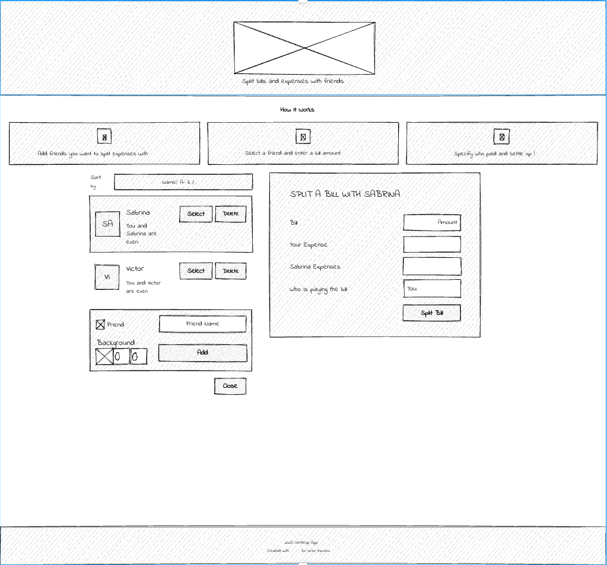

### Mobile Screens
| Screen 1                                                                 | Screen 2                                                                 | Screen 3                                                                 |
| ------------------------------------------------------------------------ | ------------------------------------------------------------------------ | ------------------------------------------------------------------------ |
| 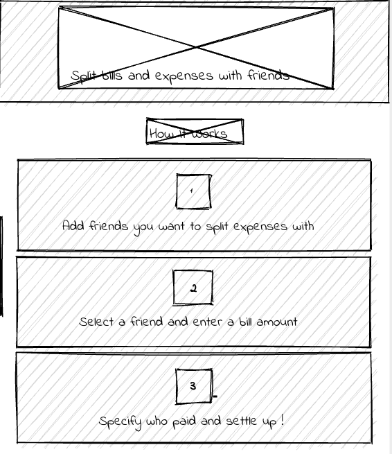 | 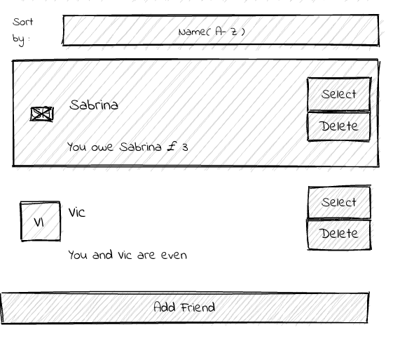 | 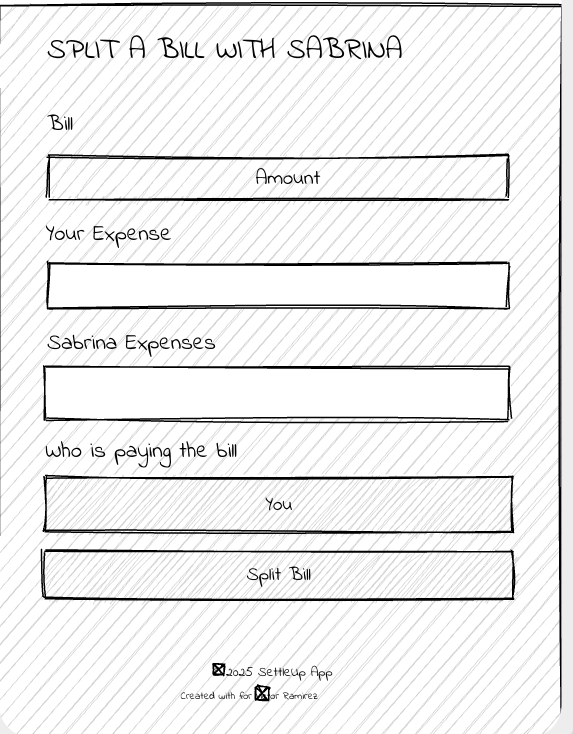 |


## 🧪 Testing Results

### Quality Assurance Verification

| Test Case                 | Screenshot                                                        | Description                                                   |
| ------------------------- | ----------------------------------------------------------------- | ------------------------------------------------------------- |
| **Successful Deployment** | 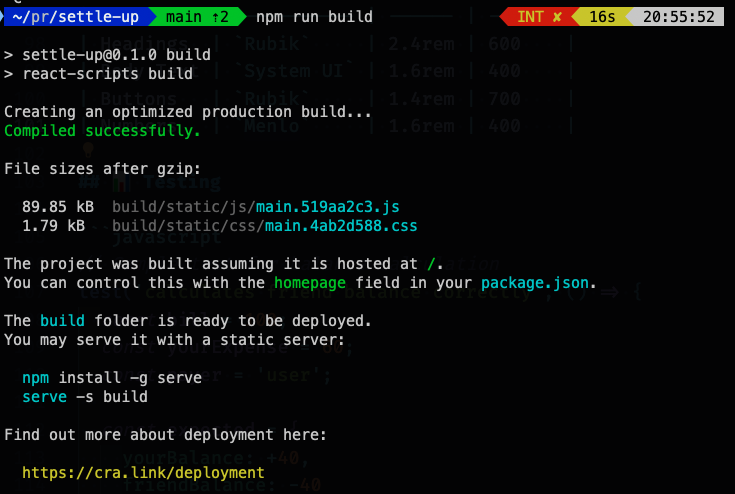     | All builds pass with zero errors in production deployment     |
| **Performance Metrics**   | 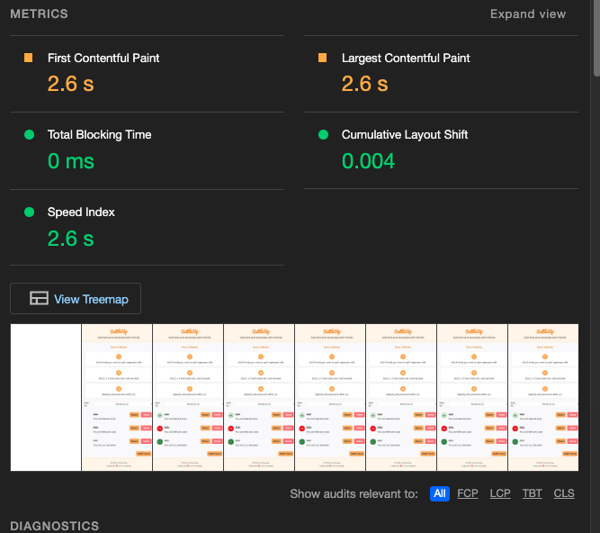           | Excellent Lighthouse scores (>90) for all critical web vitals |
| **Error-Free Console**    | 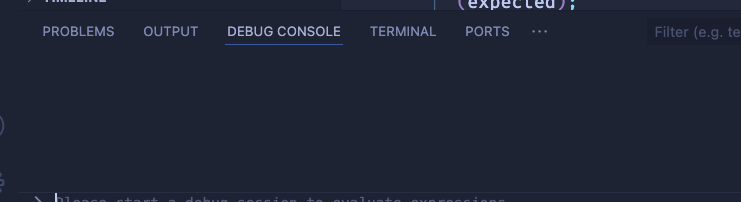 | No warnings or errors in browser developer tools              |
| **Code Quality**          | 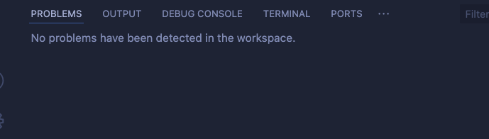 | 100% clean code with no JSLint/ESLint violations              |
| **Speed Test**            | 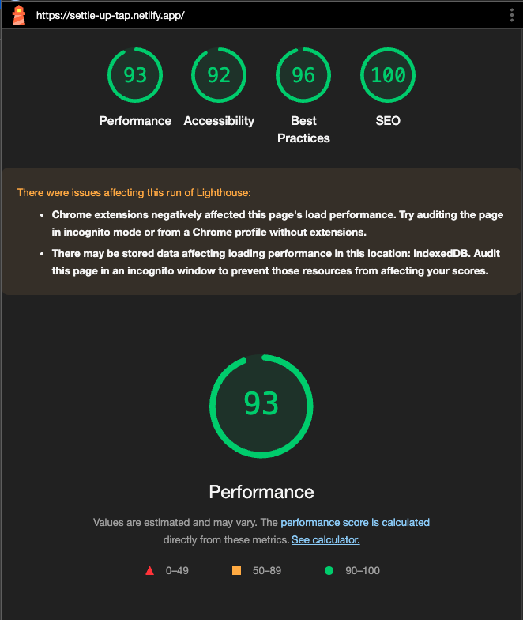   | Sub-second load times across all device types                 |
| **Delivery Test**         | 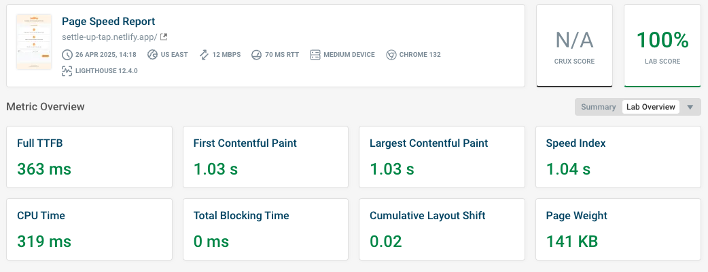         | Fast load                                                     |
| **Rendering Speed Test**  | 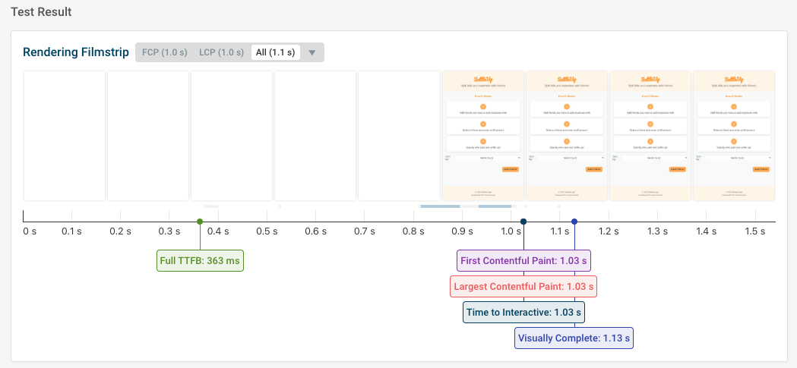     | Rendering load times                                          |

<sub>✅ All test results meet or exceed project quality standards</sub>

```javascript
// Sample test for balance calculation
test('calculates friend balance correctly', () => {
  const bill = 100;
  const yourExpense = 60;
  const payer = 'user';
  
  const expected = {
    yourBalance: +40,
    friendBalance: -40
  };

  expect(calculateBalances(bill, yourExpense, payer)).toEqual(expected);
});
```
### Manual Testing

Below is the manual testing performed for SettleUp to ensure all features work as expected.

| Feature               | Action                                                | Expected Result                              | Tested | Passed | Comments                                 |
| --------------------- | ----------------------------------------------------- | -------------------------------------------- | ------ | ------ | ---------------------------------------- |
| **Friend Management** |                                                       |                                              |        |        |                                          |
| Add Friend            | Click "+ Add Friend", enter name and background color | New friend appears in list with £0 balance   | Yes    | Yes    | -                                        |
| Delete Friend         | Click "❌" on friend card                              | Friend is removed from list                  | Yes    | Yes    | Confirmation dialog would improve safety |
| **Bill Splitting**    |                                                       |                                              |        |        |                                          |
| Enter Bill Amount     | Type "100" in bill field                              | Field accepts numeric input                  | Yes    | Yes    | Non-numeric input blocked                |
| Set Your Expense      | Type "40" in your expense field                       | Friend's expense auto-calculates as £60      | Yes    | Yes    | Disables if > bill amount                |
| Select Payer          | Choose "You" or friend from dropdown                  | Correct balance adjustment shown             | Yes    | Yes    | -                                        |
| Submit Split          | Click "Split Bill"                                    | Balances update (green if owed, red if owes) | Yes    | Yes    | Persists after refresh                   |
| **Data Persistence**  |                                                       |                                              |        |        |                                          |
| Refresh Page          | Reload browser                                        | All friends and balances remain              | Yes    | Yes    | Uses IndexedDB                           |
| **Responsiveness**    |                                                       |                                              |        |        |                                          |
| Mobile View           | Resize to 375px width                                 | All components stack neatly                  | Yes    | Yes    | Form inputs remain usable                |
| Tablet View           | Resize to 768px width                                 | Sidebar and split form appear side-by-side   | Yes    | Yes    | -                                        |

## Edge Case Testing

| Scenario              | Action                       | Result                          | Passed |
| --------------------- | ---------------------------- | ------------------------------- | ------ |
| Negative Balance      | Set friend's balance to -£20 | Shows "You owe John £20" in red | Yes    |
| Zero Balance          | Settle up with £0 difference | Shows "You and John are even"   | Yes    |
| Large Number Handling | Enter £999999 bill           | Calculates correctly            | Yes    |
| Form Validation       | Submit empty split bill form | Shows error highlights          | Yes    |

## Credits

### Technologies
- **React**: Frontend framework
- **Dexie.js**: IndexedDB wrapper for data persistence
- **CSS Modules**: Component-scoped styling
- **Google Fonts**: "Pacifico" for logo typography

### Design Resources
- **Color Palette**: Selected from [Coolors](https://coolors.co/ff922b-ffe8cc-66a80f-e03131)
- **Icons**: [React Icons](https://react-icons.github.io/react-icons/) library
- **UI Inspiration**: Inspired by Splitwise app

### Testing Tools
- **ESLint**: Code quality checks
- **React Testing Library**: Component tests
- **Chrome DevTools**: Debugging and performance analysis